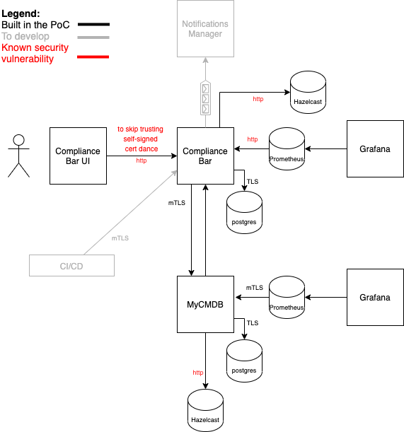

This project showcases a tool for promoting security compliance of your applications.

It is based on an initiative I developed and ran at work. There we utilized the tooling used by the company but here I want to play with this idea using code.

### What was the concept of the initiative?
I interviewed people from various departments and backgrounds trying to see what are the challenges we face in being compliant. Based on their responses I categorized their views under the following challenges:
* teams lack awareness (do not know about policies)
* teams are not sure which policies apply to them
* teams do not know how to start, what to do to be compliant or how to do it
* teams cannot get priority for such work

More details on my blog [here](https://www.tasosmartidis.com/2020/12/how-we-improved-security-posture-in.html)

The answer to these challenges was <b>compliance shots</b>! The idea is simple, each compliance shot is composed of:
* Explanation of what we had to do in 2-3 sentences
* A reference to the policy that brings the given requirement
* A tutorial or guide on how to do it
* A related story, to make it visible, introduce it to POs and keep track of the progress

So now let's build a system to facilitate this idea!

### What is the business value?
* _**Teams do not need to find out what they have to do to be compliant, we let them know**_. The tool helps identify which applications are in scope for a given item and notifies them. We find for which applications are applicable based on their AIC rating (AIC = Availiability, Integrity, Confidentiality)
* _**Teams are notified but also instructed on what they have to do**_. Bite-sized, actionable items.
* _**Reporting is provided for overall compliancy, per compliancy topic and per application**_. It helps to better estimate and plan work. It helps identify where we need to focus our actions.
* _**Possible integration of multiple CMDB (Configuration management database -ITIL) systems, providing a single view and call to action even in a heterogeneous ecosystem**_
* _**Compliancy baked in the release process**_.Too provides hooks for the CI/CD pipelines of teams and can impact the decision on a new release go-ahead based on compliance status of blocking items.
* _**Helps with auditability**_

### What can I find here?
* Documentation ([system design](docs/architecture-diagrams/system-design.png) , [db-schema](docs/architecture-diagrams/compliance-bar-db-schema.png), [ADRs](docs/architecture-decisions))
* A main application (aka compliance bar) and two supporting applications, mycmdb and notifications-manager(todo)
* A [video](#small-demo-of-the-application) showcasing the tool
* A demo environment. Check [how to run it locally](#run-it-locally)

### System design
Our main tool is the **compliance bar**, which does the following
* allows to create compliance shots
* queries external cmdb applications to retrieve applications in scope and notify their owners
* visualizes progress/status per compliance shots and configuration items (i.e., applications)
* provides hooks for pipelines so teams can validate that the application does not have compliance issue pending before going to production (todo)

Supporting applications:
* **mycmdb** for managing your configuration items. Compliance bar consumes its services. This is a stub for your existing CMDB
* **notifications-manager** used to distribute asynchronously the new compliant shots to the system owners (on hold for now)

A picture is worth a thousand words I hear, so maybe an image of the ecosystem can help:

### Small demo of the application
Place video here

### Implementation includes
* Monitoring with Prometheus and Grafana
* Hazelcast for distributed caching and session storage
* Rate limiting
* Load testing with jmeter
* Secured connections (picture shows where this is not the case)
* User interface

### Is it complete from a business/real-use case perspective?
Noope! There are a lot of things that should be built to close the loops. For example:
* Endpoint from compliance-bar to get all applicable compliance shots for a new configuration item (application) we create
* Editing compliance shots, for example to remove or add CIs, change the compliance level
* Endpoint and UI for changing the status of configuration items and the authorization logic for who can change it. And integrity controls about the changes
* Able to cancel compliance shot completely. Or to change the AIC rating and notify CIs to which it does not apply anymore
* Hook endpoint for CI/CD pipelines to check if they can release. With some signing of the response for audit purposes
* And lots more...

### Run it locally
* All you need is docker
* in the [deployment folder](deployment) you can run `docker-compose up` and play with the application (it will take some time...)
* there is a [diagram](deployment/deployment-diagram.png) of the deployment to easily view what is deployed and the container names
* to use compliance bar navigate to `http://localhost:9000/login`
  * credentials: username=tasos, pass=iamauser
* to see the monitoring dashboard of mycmdb navigate to `http://localhost:4000/d/O42f3s5nb/compliance-bar-dashboard` 
