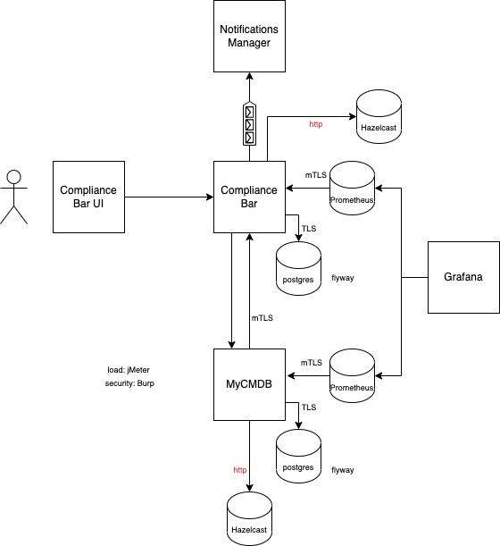

This project showcases a tool for promoting security compliance of your applications.

It is based on an initiative I developed and ran at work. At work we utilized the tooling used by the company but here I want to play with this idea using code.

### So what was the concept of the initiative?
I interviewed people from various departments and backgrounds trying to see what are challenges we face in being compliant. Based on their responses I categorized their views under the following challenges:
* teams lack awareness (do not know about policies)
* teams are not sure which policies apply to them
* teams do not know how to start, what to do to be compliant or how to do it
* teams cannot get priority for such work

More details on this in my blog [here](https://www.tasosmartidis.com/2020/12/how-we-improved-security-posture-in.html)

The solution these challenges was <b>compliance shots</b>! The idea is simple, each compliance shot is composed of:
* Explanation of what we had to do in 2-3 sentences
* A reference to the policy that brings the given requirement
* A tutorial or guide on how to do it
* A related story, to make it visible, introduce it to POs and keep track of the progress

So now let's build a system to facilitate this idea!

### What can I find here?
* Documentation (system design, threat model, monitoring design, performance test, adrs)
* A main application (aka compliance bar) and two supporting applications, mycmdb and email-sender
* A demo environment. Just use `docker-compose up` and you can play with the application, see monitoring dashboards, simulate extra traffic than yourself

### Some context please
So let's see now how this would work. Our main tool is the **compliance bar**, which does the following
* allows to create compliance shots
* queries external cmdb applications to send the shots only to those for which the shot is applicable (based on their aic rating)
* visualizes progress/status of compliance shots, overview of the compliance shots per team, etc.
* provides hooks for pipelines so teams can validate that the application does not have compliance issue pending before going to production

* find which systems apply to a measure and send them the shot
* track progress and see overview
* provide hook for pipelines so they cannot release if a blocking shot is not in status done or waived (how to convice them to add it in their pipeline is another discussion)

Supporting applications:
* **mycmdb** for managing your CIs. Compliance bar consumes its services
* **notifications-manager** used to distribute asynchronously the new compliant shots to the system owners

A picture is worth a thousand words I hear, so maybe an image of the ecosystem can help:

